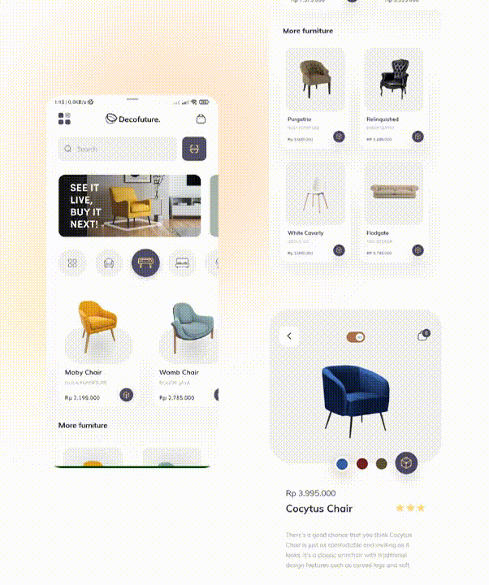

 

  

  <h3 align="center">Decofuture</h3>
  

    AR Furniture Application
     
     
  

    <a href="https://play.google.com/store/apps/details?id=com.retruxstudio.decofuture2">Play Store Link</a>
     
     
  

  

## About the App

Decofuture is an AR Furniture marketplace application that aims to bring furniture as close as possible to real life in your room before buying it, so you wont be dissapointed!

## Made With

- Flutter
- Google ARCore
- ModelViewer
- Firebase 

## Requirements

- Android 7.0+

## Installation

Download: https://drive.google.com/file/d/1bAlyq5w7GZXGZX0fM1GNEGVO-0c7s8cn/view?usp=sharing

Simply run and install this app just like any other app

Note: This app is still in development, if you maange to get this app from this link than you're one of the choosen one to try it.

